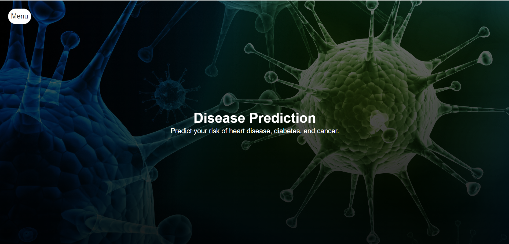
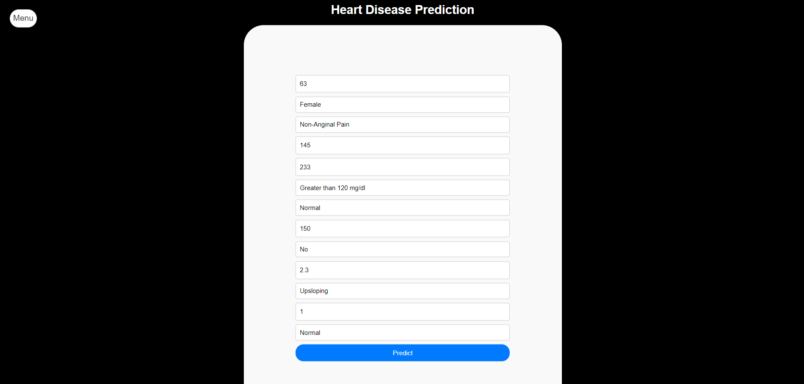
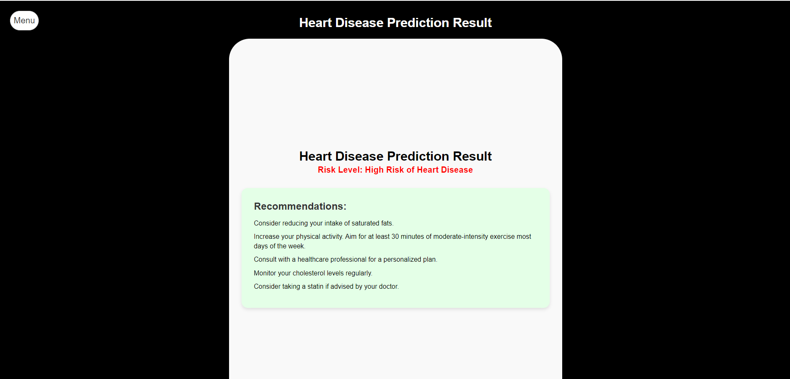

# Disease Prediction Projects

This repository contains machine learning models for predicting heart disease, diabetes, and cancer using three different algorithms: Support Vector Machine (SVM), Linear Regression (LR), and Random Forest (RF).

## Overview

Each disease-specific project is contained within its own directory, including datasets, trained models, and performance evaluation results.

## Performance Metrics

### Heart Disease Prediction

### Heart Disease Prediction

| Algorithm | Accuracy | Precision | Recall | F1-Score |
|-----------|----------|-----------|--------|----------|
| SVM       | 0.91     | 0.88      | 0.86   | 0.87     |
| LR        | 0.88     | 0.86      | 0.84   | 0.85     |
| RF        | 0.91     | 0.90      | 0.89   | 0.89     |

### Diabetes Prediction

| Algorithm | Accuracy | Precision | Recall | F1-Score |
|-----------|----------|-----------|--------|----------|
| SVM       | 0.98     | 0.98      | 0.95   | 0.97     |
| LR        | 0.96     | 0.97      | 0.92   | 0.94     |
| RF        | 0.95     | 0.94      | 0.93   | 0.94     |

### Cancer Prediction

| Algorithm | Accuracy | Precision | Recall | F1-Score |
|-----------|----------|-----------|--------|----------|
| SVM       | 0.79     | 0.75      | 0.89   | 0.82     |
| LR        | 0.89     | 0.88      | 0.86   | 0.87     |
| RF        | 0.89     | 0.88      | 0.87   | 0.88     |

## Getting Started

To run the models and generate similar results, follow these steps:

1. Clone the repository.
2. Navigate to the project directory.
3. Load the dataset and train the models using the appropriate libraries and functions.
4. Evaluate the models using the performance metrics mentioned above.

## Contributions

Contributions to improve the models or documentation are welcome. Please feel free to submit pull requests or report issues.
